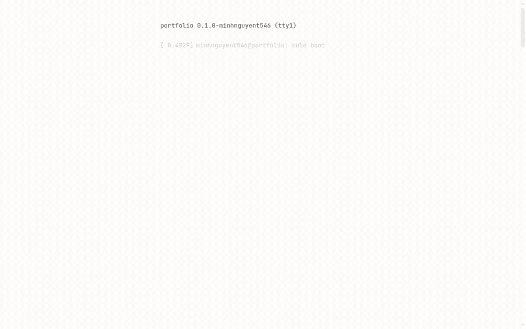

# Portfolio

A personal portfolio for research, engineering projects, publications, and writing.



> This site is a work in progress.

## Development

Requires `node` 22.15+ and `pnpm`.

```sh
pnpm install        # Install dependencies
pnpm dev            # Start the local development server
pnpm build          # Check and create a production build
pnpm preview        # Preview the production build
pnpm lint           # Run ESLint
pnpm format         # Format files with Prettier
pnpm format:check   # Check formatting without changing files
```

## Acknowledgments

This site uses [AstroPaper](https://github.com/satnaing/astro-paper) as its structural foundation and is built with [Astro](https://astro.build/).

## License

The source code is available under the [MIT License](LICENSE).
