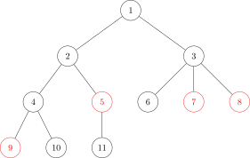
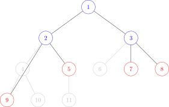

## Table of contents

## Introduction

### What is an auxiliary tree?

An auxiliary tree (also known as a virtual tree) is a technique for solving a class of problems that query a subset of the vertices of a given tree.

A normal tree query problem asks one question about the whole tree, and techniques such as centroid decomposition, tree dynamic programming, or DSU on tree answer it. Now keep the question but split it into $Q$ queries, where each query asks only about a given set of vertices. This technique builds a smaller tree from the vertices in the query plus a few extra ones, which is the same as dropping the vertices that the query does not need. You then solve that smaller tree the same way you solved the whole one.

Here is the auxiliary tree built from an original tree:
<div class="figure-pair">
<figure>



<figcaption><em>The original tree</em></figcaption>
</figure>
<figure>



<figcaption><em>The auxiliary tree</em></figcaption>
</figure>
</div>

The red vertices are the query vertices, and the blue ones are the vertices that the technique adds.

### Prerequisites

To follow this article, you need to know:

- Trees and the basic traversals (DFS, BFS).
- Lowest common ancestor (LCA).

### The problem

Look at this simple problem first:

**Problem:** you have a tree with $N$ vertices $(1 \le N \le 2 \cdot 10^5)$. Compute the sum of the distances of every pair of vertices in the tree. That is, compute:

$$
\sum\limits_{u = 1}^{n}{\sum\limits_{v = u + 1}^{n}{\text{dist}(u, v)}}
$$

where $\text{dist}(u, v)$ is the distance between the vertices $u$ and $v$.

This is a familiar problem, and a DFS answers it. Here is a harder version:

**Harder version:** there are $Q$ queries. Query $i$ gives $k_i$ vertices, where the sum of all $k_i$ does not exceed $2 \cdot 10^5$, and asks for the sum of the distances of every pair among those $k_i$ vertices.

With many queries you cannot run a DFS over the whole tree for each one. The important constraint is that the sum of $k_i$ stays at most $2 \cdot 10^5$. So if each query can drop the vertices it does not need and shrink the tree, the problem is solved.

## Sample implementation

### Preprocessing

First run a DFS on the original tree to record the visit order and to find the parent of each vertex.

Notation:

- `tin[u]`: the visit order of vertex $u$ in the DFS.
- `anc[j][i]`: a sparse table that holds the $2^j$-th ancestor of vertex $i$.
- `adj[u]`: the vertices adjacent to $u$ in the original tree.
- `tout[u]`: the visit order of the last child in the subtree rooted at $u$.
- `depth[u]`: the depth of vertex $u$.

```cpp
void dfs(int u, int prev = -1) {
    tin[u] = timer++;
    anc[0][u] = prev;
    for (int v : adj[u]) {
        if (v != prev) {
            depth[v] = depth[u] + 1;
            dfs(v, u);
        }
    }
    tout[u] = timer - 1;
}

void preprocess() {
    dfs(0);
    for (int j = 1; j < LOG; ++j) {
        for (int i = 0; i < n; ++i) {
            anc[j][i] = (anc[j - 1][i] != -1 ? anc[j - 1][anc[j - 1][i]] : -1);
        }
    }
}
```
