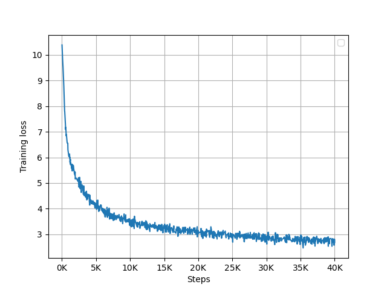
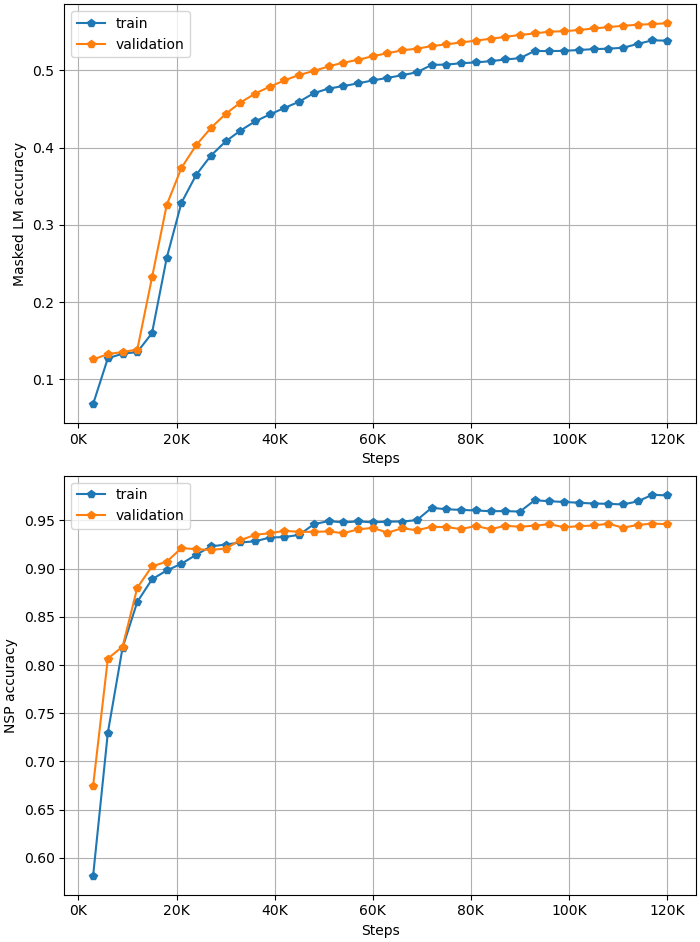
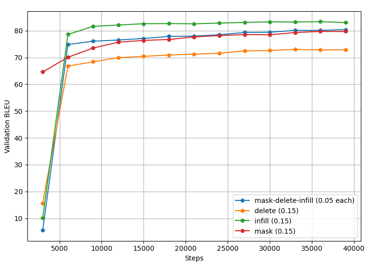
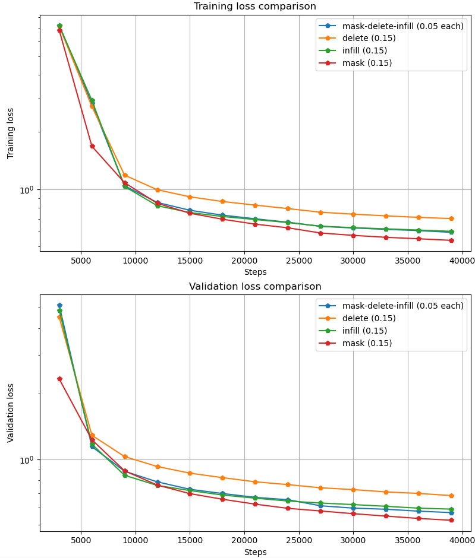

## Mục lục

## Pre-train mô hình GPT2

### Pre-training objective

Mô hình GPT2 được pre-train với objective là autoregressive language modeling.

Với một câu input đầu vào, mục tiêu của mô hình là sinh ra token dự đoán tiếp theo cho câu. Ví dụ với một document như sau: "_**bóng chày là môn thể thao phổ biến** nhất tại Puerto Rico và nước này có hẳn một mùa giải bóng chày chuyên nghiệp riêng được tổ chức vào mùa đông_" với mẫu input là đoạn được in đậm, việc dự đoán có thể được minh hoạ như sau:

|      |          |        |         |         |          |         |          | next token |
| :--- | :------: | :----: | :-----: | :-----: | :------: | :-----: | :------: | :--------: |
| bóng |          |        |         |         |          |         |          |  **chày**  |
| bóng | **chày** |        |         |         |          |         |          |   **là**   |
| bóng |   chày   | **là** |         |         |          |         |          |  **môn**   |
| bóng |   chày   |   là   | **môn** |         |          |         |          |  **thể**   |
| bóng |   chày   |   là   |   môn   | **thể** |          |         |          |  **thao**  |
| bóng |   chày   |   là   |   môn   |   thể   | **thao** |         |          |  **phổ**   |
| bóng |   chày   |   là   |   môn   |   thể   |   thao   | **phổ** |          |  **biến**  |
| bóng |   chày   |   là   |   môn   |   thể   |   thao   |   phổ   | **biến** |  **nhất**  |

Do đó label tương ứng với câu input trên là: **chày là môn thể thao phổ biến nhất**.

### Pre-training

Các tham số được sử dụng:

| Tham số           | Giá trị  |
| ----------------- | :------: |
| hidden_size       |  $384$   |
| num_layers        |   $6$    |
| num_heads         |   $6$    |
| intermediate_size |  $1536$  |
| dropout           |  $0.1$   |
| seq_length        |  $256$   |
| activation        |   GELU   |
| optim             |  AdamW   |
| weight_decay      | $0.0001$ |
| lr                |  $0.5$   |
| warmup_steps      |  $4000$  |
| batch_size        |   $32$   |
| max_grad_norm     |  $1.0$   |

Mô hình được train trên 50MB text được trích xuất ra từ [corpus.viwiki](https://github.com/undertheseanlp/corpus.viwiki), train với tổng số bước là $40K$. Mô hình có 35M tham số. Hình bên dưới là đồ thị biểu diễn loss của mô hình trong quá trình training.

<figure>



<figcaption><em>Training loss của mô hình GPT2</em></figcaption>
</figure>

Ví dụ về một số đoạn text được sinh bởi mô hình:

```bash
python gpt2/generate.py \
    --model ./checkpoints/gpt2-40000.pt \
    --tokenizer ./checkpoints/tokenizer.json \
    --seed 42 \
    --max-new-tokens 120 \
    --temperature 1
```

kết quả:

```
>> Nghiên cứu là một quá
Nghiên cứu là một quá trình tạo ra các chất hút điện ngoài sự vật chất . Có hai lĩnh vực điện xuất nhằm tạo ra các loại nguyên tử tự nhiên thù của các kim loại - kim loại . Gốc vụ có thể có các loại kim loại như hiđrua liti , Gd và các loại sulfua kim loại khác . Các chất phóng xạ khác gồm các đồng ( 90 %), 1 %, ") [ 25 ] 6H2O ( 20 % tương đương với 66 %.
Các hợp chất ở dạng O2 là hyđrô sulfit ở nhiệt độ thấp , là một trong các điều kiện quan trọng cho sự cháy cháy . Các chất này là nguồn
```

```bash
python gpt2/generate.py \
    --model ./checkpoints/gpt2-40000.pt \
    --tokenizer ./checkpoints/tokenizer.json \
    --seed 42 \
    --max-new-tokens 40 \
    --temperature 0.5
```

kết quả:

```
>> Đầu năm 2021
Đầu năm 2021 , một nhóm hội nghị quốc tế đã được thành lập tại Paris năm 1973 , và cuộc họp này đã được tổ chức bởi các đảng hợp nhất . Năm 1999 , Hội nghị thượng đỉnh thứ nhất được
```

## Pre-train mô hình BERT

### Pre-training objective

Mô hình BERT được pre-train trên hai bài toán là **masked language modeling** (MLM) và **next sentence prediction** (NSP).

### Pre-training

Các tham số được sử dụng (bộ tham số BERT-medium):

| Tham số           | Giá trị |
| ----------------- | :-----: |
| hidden_size       |  $512$  |
| num_layers        |   $8$   |
| num_heads         |   $8$   |
| intermediate_size | $2048$  |
| dropout           | $0.15$  |
| attention_dropout | $0.15$  |
| pooler_dropout    |  $0.3$  |
| seq_length        |  $128$  |
| activation        |  GELU   |
| optim             |  AdamW  |
| weight_decay      | $0.005$ |
| lr                |  $0.6$  |
| warmup_steps      | $10000$ |
| batch_size        |  $64$   |
| max_grad_norm     |  $1.0$  |

Mô hình được train trên tập text kích thước 500MB được trích ra từ tập dữ liệu [OSCAR](https://huggingface.co/datasets/oscar-corpus/oscar), tập dữ liệu sau khi được xử lý có tổng số mẫu là khoảng $1$ triệu $400$ (việc tạo tập dữ liệu được thực hiện như mô tả của nhóm tác giả).

Mô hình có tổng số tham số là khoảng $58M$ và được train với $128K$ bước. Mô hình đạt được accuracy với MLM là $0.561$ và NSP là $0.946$ trên tập test.

<figure>



<figcaption><em>Accuracy đối với MLM và NSP của mô hình</em></figcaption>
</figure>

Đối với NSP thì mô hình hội tụ khá nhanh, còn đối với MLM thì lại khá chậm.

Ví dụ kết quả của mô hình trên tác vụ dự đoán [MASK] token:

```python
sentence = '[CLS] Anh [MASK] là một [MASK] trai thấp [MASK] [SEP]'
>> predictions = [
    {
        'token': 'cũng',
        'score': 0.12953687
    },
    {
        'token': 'chàng',
        'score': 0.85561085
    },
    {
        'token': 'giọng',
        'score': 0.1861668
    },
]
```

## Pre-train mô hình BART

### Pre-training objective

Mô hình BART được pre-train với objective là denoising objective.

### Pre-training

Các tham số được sử dụng:

| Tham số           | Giá trị |
| ----------------- | :-----: |
| hidden_size       |  $512$  |
| num_layers        |   $6$   |
| num_heads         |   $8$   |
| intermediate_size | $2048$  |
| dropout           |  $0.1$  |
| attention_dropout |  $0.1$  |
| src_seq_length    |  $128$  |
| target_seq_length |  $156$  |
| activation        |  GELU   |
| optim             |  AdamW  |
| weight_decay      | $0.005$ |
| lr                |  $0.5$  |
| warmup_steps      | $8000$  |
| batch_size        |  $32$   |
| max_grad_norm     |  $1.0$  |
| beam_size         |   $4$   |

Mô hình được train trên tập text kích thước 500MB được trích ra từ tập dữ liệu [OSCAR](https://huggingface.co/datasets/oscar-corpus/oscar), cách xử lý dữ liệu được thực hiện theo mô tả của nhóm tác giả. Mô hình được thử nghiệm trên $4$ tập dataset với khoảng $750K$ mẫu huấn luyện, tương ứng với các thao tác biến đổi và tỉ lệ như sau:

- Token masking: tỉ lệ $0.15$
- Token deletion: tỉ lệ $0.15$
- Text infilling: tỉ lệ $0.15$
- Token masking + token deletion + text infilling: mỗi loại tỉ lệ $0.05$

Mô hình có tổng số tham số là khoảng $61M$, train trong $40K$ bước. Dưới đây là một số kết quả của mô hình:

<figure>



<figcaption><em>BLEU score trên tập validation</em></figcaption>
</figure>

Có thể thấy điểm BLEU đạt cao nhất với **text infilling** so với **token masking** và **token masking + token deletion + text infilling** (do một vài các token liên tiếp được thay bởi một token [MASK] duy nhất dẫn đến số token [MASK] trong câu khá ít so với hai cách còn lại). **Token deletion** là khá khó đối với mô hình.

<figure>



<figcaption><em>Training loss và validation loss của mô hình</em></figcaption>
</figure>

Ví dụ kết quả của mô hình với **token masking**:

- source: từ 2 năm trở lên bạn vẫn có thể tiến hành đăng ký biển số xe Hà **[MASK]** **[MASK]** đó nếu bạn muốn đăng **[MASK]** **[MASK]** số xe Hà Nội bạn làm Ngọ tục sang tên tại quận
- prediction: từ 2 năm trở lên bạn vẫn có thể tiến hành đăng ký biển số xe Hà **Nội** **Do** đó nếu bạn muốn đăng **ký** **một** số xe Hà Nội bạn làm thủ tục sang tên tại quận
- target: từ 2 năm trở lên bạn vẫn có thể tiến hành đăng ký biển số xe Hà **Nội** **Theo** đó nếu bạn muốn đăng **ký** **biển** số xe Hà Nội bạn làm thủ tục sang tên tại quận

Ví dụ kết quả của mô hình với **token deletion**:

- source: tổ hợp Vincom và phố thương mại shophouse Khu đô du lịch hỗn hợp Dinh Mười ( 28 tỷ đồng ), Khu thự nghỉ dưỡng Bảo Ninh ( 1000 tỷ đồng ) đã cho thấy giá trị thực sự ở đặc biệt là bất động sản nghỉ dưỡng Cùng với đó các mạnh sẵn có về nhiên với 116
- prediction: tổ hợp Vincom và **thành** phố thương mại shophouse Khu đô **thị** du lịch hỗn hợp Dinh Mười ( 28 tỷ đồng ), Khu **biệt** thự nghỉ dưỡng Bảo Ninh ( 1000 tỷ đồng ) đã cho thấy giá trị thực sự ở đặc biệt là bất động sản nghỉ dưỡng Cùng với đó **,** các **điểm** mạnh sẵn có về **tự** nhiên với 116 **tỷ đồng**
- target: tổ hợp Vincom và **nhà** phố thương mại shophouse **,** Khu đô **thị** du lịch hỗn hợp Dinh Mười ( 28 **800** tỷ đồng ), Khu **biệt** thự nghỉ dưỡng Bảo Ninh **Sunrise** ( 1000 tỷ đồng ) đã cho thấy giá trị thực sự ở **đây** **,** đặc biệt là bất động sản nghỉ dưỡng Cùng với đó **,** các **thế** mạnh sẵn có về **thiên** nhiên với 116 **km**

Ví dụ kết quả của mô hình với **text infilling**:

- source: giấy phép xây dựng hầm , 8 **[MASK]** kế 23 căn hộ dịch vụ , hồ bơi sân thượng , đối diện bến du **[MASK]** giao **[MASK]** tiện Sổ hồng **[MASK]** **cầy** Cần tiền bán gấp nhà mặt tiền Hoàng Diệu
- prediction: giấy phép xây dựng hầm , 8 **tầng , thiết** kế 23 căn hộ dịch vụ , hồ bơi sân thượng , đối diện bến du **lịch** , giao **thông thuận** tiện Sổ hồng **sân thượng , chợ Bến Thành - Diện tích**
- target: giấy phép xây dựng hầm , 8 **lầu , thiết** kế 23 căn hộ dịch vụ , hồ bơi sân thượng , đối diện bến du **thuyền** , giao **thông thuận** tiện Sổ hồng **chính chủ 34 tỷ Liên** Cần tiền bán gấp nhà mặt tiền Hoàng Diệu
